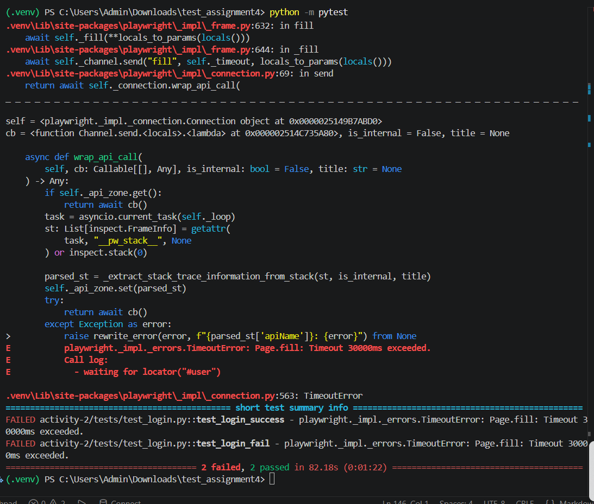
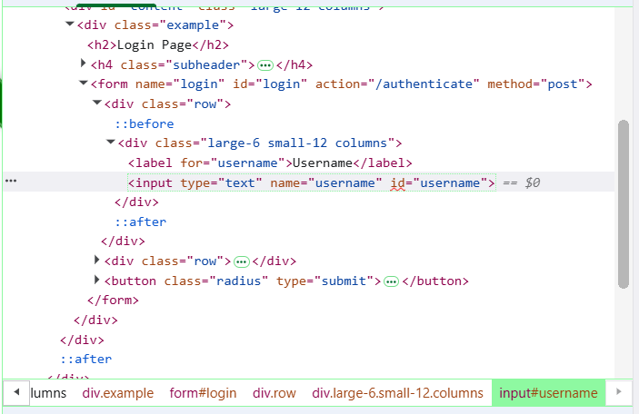

Đóng vai Senior Automation QA Engineer có nhiều kinh nghiệm với Playwright (Python) và Page Object Model (POM).

Tôi đang gặp lỗi khi chạy Automation Test. Hãy phân tích nguyên nhân dựa trên các thông tin tôi cung cấp dưới đây.

=========================
1. Bối cảnh
=========================

Website:
https://the-internet.herokuapp.com/login

Framework:
Playwright (Python)

Kiến trúc:
Page Object Model (POM)

Mục tiêu test:
- TC01: Đăng nhập thành công.
- TC02: Đăng nhập thất bại.

=========================
2. Error Log
=========================

====================================================== FAILURES ======================================================
_________________________________________________ test_login_success _________________________________________________

    def test_login_success():
        with sync_playwright() as p:
            browser = p.chromium.launch(headless=False)
            page = browser.new_page()
            login_page = LoginPage(page)
    
            # Bước 1-3: dùng chung action login() từ Page Object
            login_page.goto()
>           login_page.login(VALID_USERNAME, VALID_PASSWORD)

activity-2\tests\test_login.py:49: 
_ _ _ _ _ _ _ _ _ _ _ _ _ _ _ _ _ _ _ _ _ _ _ _ _ _ _ _ _ _ _ _ _ _ _ _ _ _ _ _ _ _ _ _ _ _ _ _ _ _ _ _ _ _ _ _ _ _ _ 
activity-2\pages\login_page.py:35: in login
    self.fill_username(username)
activity-2\pages\login_page.py:25: in fill_username
    self.page.fill(self.username_input, username)
.venv\Lib\site-packages\playwright\sync_api\_generated.py:11156: in fill
    self._sync(
.venv\Lib\site-packages\playwright\_impl\_page.py:925: in fill
    return await self._main_frame.fill(**locals_to_params(locals()))
           ^^^^^^^^^^^^^^^^^^^^^^^^^^^^^^^^^^^^^^^^^^^^^^^^^^^^^^^^^
.venv\Lib\site-packages\playwright\_impl\_frame.py:632: in fill
    await self._fill(**locals_to_params(locals()))
.venv\Lib\site-packages\playwright\_impl\_frame.py:644: in _fill
    await self._channel.send("fill", self._timeout, locals_to_params(locals()))
.venv\Lib\site-packages\playwright\_impl\_connection.py:69: in send
    return await self._connection.wrap_api_call(
_ _ _ _ _ _ _ _ _ _ _ _ _ _ _ _ _ _ _ _ _ _ _ _ _ _ _ _ _ _ _ _ _ _ _ _ _ _ _ _ _ _ _ _ _ _ _ _ _ _ _ _ _ _ _ _ _ _ _ 

self = <playwright._impl._connection.Connection object at 0x000002514C51C950>
cb = <function Channel.send.<locals>.<lambda> at 0x000002514C46C720>, is_internal = False, title = None

    async def wrap_api_call(
        self, cb: Callable[[], Any], is_internal: bool = False, title: str = None
    ) -> Any:
        if self._api_zone.get():
            return await cb()
        task = asyncio.current_task(self._loop)
        st: List[inspect.FrameInfo] = getattr(
            task, "__pw_stack__", None
        ) or inspect.stack(0)
    
        parsed_st = _extract_stack_trace_information_from_stack(st, is_internal, title)
        self._api_zone.set(parsed_st)
        try:
            return await cb()
        except Exception as error:
>           raise rewrite_error(error, f"{parsed_st['apiName']}: {error}") from None
E           playwright._impl._errors.TimeoutError: Page.fill: Timeout 30000ms exceeded.
E           Call log:
E             - waiting for locator("#user")

.venv\Lib\site-packages\playwright\_impl\_connection.py:563: TimeoutError
__________________________________________________ test_login_fail ___________________________________________________

    def test_login_fail():
        with sync_playwright() as p:
            browser = p.chromium.launch(headless=False)
            page = browser.new_page()
            login_page = LoginPage(page)
    
            # Bước 1-3: dùng chung action login() từ Page Object
            login_page.goto()
>           login_page.login(VALID_USERNAME, INVALID_PASSWORD)

activity-2\tests\test_login.py:72: 
_ _ _ _ _ _ _ _ _ _ _ _ _ _ _ _ _ _ _ _ _ _ _ _ _ _ _ _ _ _ _ _ _ _ _ _ _ _ _ _ _ _ _ _ _ _ _ _ _ _ _ _ _ _ _ _ _ _ _ 
activity-2\pages\login_page.py:35: in login
    self.fill_username(username)
activity-2\pages\login_page.py:25: in fill_username
    self.page.fill(self.username_input, username)
.venv\Lib\site-packages\playwright\sync_api\_generated.py:11156: in fill
    self._sync(
.venv\Lib\site-packages\playwright\_impl\_page.py:925: in fill
    return await self._main_frame.fill(**locals_to_params(locals()))
           ^^^^^^^^^^^^^^^^^^^^^^^^^^^^^^^^^^^^^^^^^^^^^^^^^^^^^^^^^
.venv\Lib\site-packages\playwright\_impl\_frame.py:632: in fill
    await self._fill(**locals_to_params(locals()))
.venv\Lib\site-packages\playwright\_impl\_frame.py:644: in _fill
    await self._channel.send("fill", self._timeout, locals_to_params(locals()))
.venv\Lib\site-packages\playwright\_impl\_connection.py:69: in send
    return await self._connection.wrap_api_call(
_ _ _ _ _ _ _ _ _ _ _ _ _ _ _ _ _ _ _ _ _ _ _ _ _ _ _ _ _ _ _ _ _ _ _ _ _ _ _ _ _ _ _ _ _ _ _ _ _ _ _ _ _ _ _ _ _ _ _ 

self = <playwright._impl._connection.Connection object at 0x0000025149B7ABD0>
cb = <function Channel.send.<locals>.<lambda> at 0x000002514C735A80>, is_internal = False, title = None

    async def wrap_api_call(
        self, cb: Callable[[], Any], is_internal: bool = False, title: str = None
    ) -> Any:
        if self._api_zone.get():
            return await cb()
        task = asyncio.current_task(self._loop)
        st: List[inspect.FrameInfo] = getattr(
            task, "__pw_stack__", None
        ) or inspect.stack(0)
    
        parsed_st = _extract_stack_trace_information_from_stack(st, is_internal, title)
        self._api_zone.set(parsed_st)
        try:
            return await cb()
        except Exception as error:
>           raise rewrite_error(error, f"{parsed_st['apiName']}: {error}") from None
E           playwright._impl._errors.TimeoutError: Page.fill: Timeout 30000ms exceeded.
E           Call log:
E             - waiting for locator("#user")

.venv\Lib\site-packages\playwright\_impl\_connection.py:563: TimeoutError
============================================== short test summary info ===============================================
FAILED activity-2/tests/test_login.py::test_login_success - playwright._impl._errors.TimeoutError: Page.fill: Timeout 30000ms exceeded.
FAILED activity-2/tests/test_login.py::test_login_fail - playwright._impl._errors.TimeoutError: Page.fill: Timeout 30000ms exceeded.
======================================= 2 failed, 2 passed in 82.18s (0:01:22) =======================================

=========================
3. Screenshot tại thời điểm fail
=========================

=========================
4. HTML tại thời điểm fail
=========================

<input type="text" name="username" id="username">

=========================
5. Test Script
=========================

# Language: Python 3
# Framework: Playwright (sync API) v1.4x
# Target: https://the-internet.herokuapp.com/login
# Design pattern: Page Object Model (POM)
#
# Test Case 1: TC_LOGIN_PASS
# Title: Đăng nhập thành công với tài khoản hợp lệ
# Precondition: Người dùng đang ở trang https://the-internet.herokuapp.com/login
# Steps:
#   1. Nhập username = "tomsmith"
#   2. Nhập password = "SuperSecretPassword!"
#   3. Click nút "Login"
# Expected Result:
#   - Hệ thống chuyển hướng đến trang /secure
#   - Hiển thị thông báo "You logged into a secure area!"
#
# Test Case 2: TC_LOGIN_FAIL
# Title: Đăng nhập thất bại với password sai
# Precondition: Người dùng đang ở trang https://the-internet.herokuapp.com/login
# Steps:
#   1. Nhập username = "tomsmith"
#   2. Nhập password = "wrongpassword" (sai)
#   3. Click nút "Login"
# Expected Result:
#   - Hệ thống vẫn ở lại trang /login
#   - Hiển thị thông báo lỗi "Your password is invalid!"

import sys
import os
from playwright.sync_api import sync_playwright, expect

# Cho phép import từ thư mục pages/ nằm ngoài tests/
sys.path.append(os.path.join(os.path.dirname(__file__), "..", "pages"))
from login_page import LoginPage, LOGIN_URL  # noqa: E402

VALID_USERNAME = "tomsmith"
VALID_PASSWORD = "SuperSecretPassword!"
INVALID_PASSWORD = "wrongpassword"

def test_login_success():
    with sync_playwright() as p:
        browser = p.chromium.launch(headless=False)
        page = browser.new_page()
        login_page = LoginPage(page)

        # Bước 1-3: dùng chung action login() từ Page Object
        login_page.goto()
        login_page.login(VALID_USERNAME, VALID_PASSWORD)

        # Assertion 1: URL phải chuyển sang /secure
        expect(page).to_have_url(f"{LOGIN_URL.rsplit('/', 1)[0]}/secure")

        # Assertion 2: Phải hiển thị đúng thông báo thành công
        expect(login_page.get_flash_message()).to_contain_text(
            "You logged into a secure area!"
        )

        login_page.take_screenshot("execution_evidence_success.png")
        browser.close()
        print("TEST PASSED: Login success flow works as expected.")

def test_login_fail():
    with sync_playwright() as p:
        browser = p.chromium.launch(headless=False)
        page = browser.new_page()
        login_page = LoginPage(page)

        # Bước 1-3: dùng chung action login() từ Page Object
        login_page.goto()
        login_page.login(VALID_USERNAME, INVALID_PASSWORD)

        # Assertion 1: URL phải vẫn ở lại trang /login
        expect(page).to_have_url(LOGIN_URL)

        # Assertion 2: Phải hiển thị đúng thông báo lỗi
        expect(login_page.get_flash_message()).to_contain_text(
            "Your password is invalid!"
        )

        login_page.take_screenshot("execution_evidence_fail.png")
        browser.close()
        print("TEST PASSED: Login fail flow works as expected.")

if __name__ == "__main__":
    test_login_success()
    test_login_fail()

=========================
6. Page Object
=========================

# Language: Python 3
# Framework: Playwright

LOGIN_URL = "https://the-internet.herokuapp.com/login"

class LoginPage:
    def __init__(self, page):
        self.page = page

        self.username_input = "#user"
        self.password_input = "#password"
        self.login_button = "button[type='submit']"
        self.flash_message = "#flash"

    def goto(self):
        self.page.goto(LOGIN_URL)

    def fill_username(self, username):
        self.page.fill(self.username_input, username)

    def fill_password(self, password):
        self.page.fill(self.password_input, password)

    def click_login(self):
        self.page.click(self.login_button)

    def login(self, username, password):
        self.fill_username(username)
        self.fill_password(password)
        self.click_login()

=========================
Yêu cầu
=========================

1. Phân tích nguyên nhân có thể gây ra lỗi.

2. Xếp hạng các giả thuyết theo xác suất từ cao xuống thấp.

3. Đối với mỗi giả thuyết hãy giải thích:
- Vì sao nghĩ như vậy.
- Bằng chứng từ Error Log.
- Bằng chứng từ Screenshot.
- Bằng chứng từ HTML.
- Bằng chứng từ Test Script và Page Object.
- Cách xác minh.

4. Xác định Root Cause.

5. Đề xuất cách sửa.

6. Đề xuất cách phòng tránh lỗi tương tự.

=========================
Định dạng đầu ra
=========================

| Rank | Hypothesis | Probability | Evidence | Verification |
|------|------------|-------------|----------|--------------|

Sau bảng hãy trình bày:

### Root Cause

### Recommended Fix

### Prevention

Lưu ý:

- Không đưa ra kết luận khi chưa có bằng chứng.
- Chỉ sử dụng thông tin tôi đã cung cấp.
- Nếu chưa đủ dữ liệu thì phải nói rõ còn thiếu dữ liệu nào.